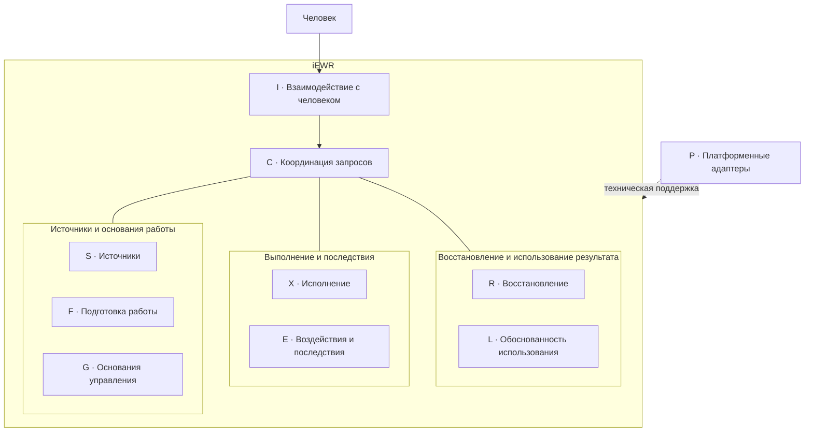

# Instantiatio EWR (iEWR)

**Среда организации и исполнения инженерной работы людей, ИИ-агентов и инструментов на основе FPF.**

Версия: **5.2.2-beta.3, редакция документации 2**. Кандидат закрытого бета-тестирования для приёмки пользователем.
Исходная поставка — 5.2.2-beta.3 с доработками выбора DPF, хранения файлов и ведения поручения. В этой редакции уточнён язык основного README; программный код и правила модулей сохранены.
Состав изменений, результаты испытаний и ограничения — в [сведениях о поставке](BASELINE_STATUS.md).
Готовность к распространению не установлена (`distribution_ready=false`); публикация в GitHub требует отдельного поручения.

## Что такое iEWR

iEWR — инженерная платформа, которая связывает текущую задачу, применимые знания, способ работы, основания действий и их реальные последствия. Она помогает подготовить и выполнить работу в заданных границах, изменить ход действий по ситуации и восстановить основания продолжения после прерывания.

Результатом могут быть требования, архитектура, код, инженерная модель, исследование, документация, рекомендация или обоснованное изменение системы. Разработка программного обеспечения — одна из областей применения.

FPF задаёт внешнюю семантическую основу, DPF предоставляют предметные знания и методы. Люди и ИИ-агенты рассуждают и выполняют работу доступными инструментами. Назначения, разрешения, ответственность и полномочия устанавливаются по собственным прямым основаниям. Среда исполнения сохраняет эти различия для проверки.

## Зачем он нужен

Для использования результата недостаточно получить текст или успешно выполнить команду. Нужно знать, на какие источники опирались, что было разрешено, что действительно изменилось и какие подтверждения требуются получателю.

iEWR сохраняет эту связь при работе нескольких участников, смене агента или среды, изменении исходных данных и частичном выполнении. Объём подготовки определяется текущей потребностью: короткий вопрос может завершиться достаточным ответом или одним действием.

> Текущее поручение → необходимые разрешённые действия → достаточный результат и явное завершение. Промежуточный результат не требует нового «продолжай»; существенный выбор предъявляется человеку до зависимого действия.

## Начало работы

1. **Откройте каталог iEWR** в агентной среде, поддерживающей инструкции проекта и работу с файлами. Полученный архив сначала распакуйте.
2. **Поставьте инженерную задачу обычным языком.**
3. **Укажите необходимые исходные материалы и ограничения.**

Инструкции проекта находятся в [AGENTS.md](AGENTS.md). Для начала работы не нужно знать FPF, названия модулей или выбирать режим процесса. iEWR определяет, новая это задача или продолжение, и уточняет только сведения, необходимые для результата или разрешения действия.

Например:

```text
Помоги сравнить два варианта архитектуры подсистемы.
Требования — в приложенном документе.
```

В поставку уже включены избранные DPF. При новой содержательной задаче агент рассматривает доступную предметную основу до существенных решений о постановке, критериях и способе работы. Подходящие методы применяются по существу; отдельного напоминания не требуется. Достаточная основа используется повторно, механическая правка не запускает новый поиск.

[Путеводитель](catalog/dpf/GUIDE.md) и краткие карточки помогают найти нужный материал. Оригинал читается по текущему вопросу и условиям применения; весь набор читать не требуется.

**Дополнительный DPF** можно предоставить отдельно: укажите файл или редакцию и попросите использовать его. Для постоянного обнаружения источника доступна регистрация; для прямого использования она необязательна. Подробности — [правила подключения](modules/sources/REGISTRATION.md).

**LPF необязателен.** Если у проекта есть оформленная локальная практика, укажите её источник и область применения. iEWR работает и без неё.

На выходе вы получаете результат, существенные основания и ограничения, сведения о проверках и фактических изменениях. Если не хватает данных, технической возможности или решения человека, iEWR указывает конкретный пробел.

## Взаимодействие и подача результата

Текущий интерфейс — разговор с агентом в выбранной среде. Подача и доступные действия зависят от её конфигурации. Отдельный графический интерфейс и готовый автономный сервис в поставке не заявлены.

[Правила взаимодействия](modules/interaction/HUMAN_INTERACTION.md) помогают представить среду при знакомстве, поддерживать понятную картину работы и выбирать достаточный текст, таблицу или схему. Существенные решения, проверки и открытые вопросы показываются по ходу; разрешённые действия не требуют повторного подтверждения. Эти правила задают поведение агента: показ плана сам не запускает работу и не доказывает её выполнение.

При длительном ожидании агент поясняет, что выполняется и какие ограничения известны. Существенные основания и неизвестные условия должны быть видны до зависимого решения. Возможность применить уточнение во время операции зависит от исполняющей среды. Изменение формы подачи не подменяет уточнение содержания. Фиксированный интервал сообщений и дополнительные согласования не вводятся.

Содержательная выдача делится на блоки с заголовками. Для выбора используются **«Требуется решение»**, нумерованные варианты, рекомендация и последствия; в длинном ответе перед этим блоком — **«Кратко»**. Номера сохраняют смысл в пределах вопроса. Допустимы свободный ответ, собственный вариант и условия.

Явно указывается, нужны ли сведения, решение или действие человека, продолжается ли работа без его участия или поручение завершено. При препятствии выполняется доступная независимая работа. Завершение поручения не создаёт следующей задачи. Эти правила действуют в пределах разрешений и возможностей среды; условия совместимости подачи описаны в [руководстве адаптеров](adapters/ADAPTERS.md).

## Подключение внешнего DPF

Поместите DPF в [source/external-dpf/](source/external-dpf/), желательно сохранив исходное имя файла. Затем попросите:

```text
Зарегистрируй DPF из source/external-dpf/MUSIC-AND-DANCE-PRACTICE-ENGINEERING-PRINCIPLES-FRAMEWORK.md
```

iEWR прочитает указанный источник, установит его обозначение и редакцию, вычислит контрольную сумму, сохранит необходимые метаданные и внесёт источник в реестр DPF проекта. При постоянном подключении также подготовит краткий проектный справочник, используя пригодную авторскую навигацию. Карточки создаются по потребности; их отсутствие не мешает прямому чтению. При явном поручении изменить только индекс справочные файлы не создаются. См. [правила справочных материалов](catalog/dpf/README.md).

Исходный файл остаётся на месте. При недостатке существенных сведений iEWR называет конкретный пробел.

Регистрация позволяет находить DPF при подборе источников. Она сама не устанавливает применимость, приоритет или нормативную силу его утверждений. Из источника используются только знания и методы, подходящие текущему вопросу; исполняемым расширением DPF не становится. Для прямого использования указанного источника регистрация необязательна.

Новую редакцию регистрируют явно. Она не заменяет молча источник, на который уже опирается выполняемая работа. Технические правила и границы исполнения — в [инструкции регистрации](modules/sources/REGISTRATION.md).

## Материалы проекта и развитие iEWR

Входящие материалы размещаются в `project/source/`, формы и совместные черновики — в `project/handoff/`, результаты — в `project/artifacts/`.

Рабочий документ можно править на месте. Конкретная редакция, на которую опираются решение, проверка или передача, сохраняется; её исправление создаёт следующую редакцию. Оригиналы, зафиксированные результаты и необходимые основания по умолчанию не удаляются автоматически. Состав метаданных обосновывается использованием; пригодная история не дублируется. Прежний каталог `project/reference` автоматически не переносится. См. [правила материалов проекта](project/README.md). Пустая структура каталогов не запускает работу.

Для доработки самого iEWR достаточно поручения, например:

```text
Доработай iEWR: улучши сообщение об ошибке выбранного адаптера.
Исходная поставка — project/source/iEWR-previous.zip.
Подготовь проверенную новую поставку для моей приёмки.
```

По такому явному поручению агент применяет [правила развития iEWR](modules/self_development/GUIDANCE.md): устанавливает точный состав исходной поставки, обосновывает изменение, проверяет его и предъявляет новый архив с результатами проверок и полезным опытом. Обычные пользовательские задачи и регистрация DPF эти правила не включают.

## Как работает iEWR

**Начинает с текущей потребности.** Определяет достаточный результат для конкретного использования. Переиспользует пригодный результат с действующими основаниями. Иначе выполняет ограниченную непосредственную работу или получает недостающий подготовительный результат.

**Выбирает нужные знания и подготовку.** Использует применимые различения, ограничения и требования источников. Способ работы выбирается или уточняется в необходимом объёме. Отдельная работа над методом нужна, когда вопрос касается самого метода. План появляется для координации намеченной работы, например зависимостей или передачи исполнителю; сложность задачи сама по себе плана не требует.

**Связывает действие с действующими основаниями.** До существенного изменения проверяет исполнителя, возможности, назначение, разрешения, полномочия и технические границы. Исполнение, результат и последствия учитываются отдельно, включая частичные и неизвестные эффекты. Успех инструмента не доказывает правильность результата.

**Проверяет соразмерно использованию.** Верификация и решение человека требуются, когда они предусмотрены методом, применимым источником, действующими правилами или дальнейшим использованием. Проверка, подтверждающие сведения, решение и фактическое использование результата остаются разными фактами.

**Обоснованно восстанавливает и завершает работу.** После прерывания восстанавливает три раздельных набора сведений: действующие основания назначений, разрешений и полномочий; использованную основу выполнения; факты исполнения и эффектов. Неизвестный эффект не повторяется по догадке. Достаточный результат поручения и сверенные последствия позволяют завершить работу; изменение основания требует пересмотра только затронутой части.

Эти обязанности применяются по ситуации. Завершение действия само по себе не создаёт следующую задачу или обязательную проверку.

## Архитектура

iEWR — модульный монолит: девять функциональных модулей и семейство платформенных адаптеров в согласованном пакете. Инструкции поддерживают предметное рассуждение, детерминированные механизмы выполняют ограниченные проверяемые операции, адаптеры связывают их с конкретной средой.

| Модуль | Ответственность |
|---|---|
| **S — Источники** | Устанавливает точные источники и применимые знания, сохраняет редакции и ограничения. Наличие источника не устанавливает применимость или приоритет. |
| **F — Подготовка работы** | Определяет первый нужный результат и достаточные основания работы. Выбирает метод и формирует план, когда они нужны текущему вопросу. |
| **G — Основания управления** | Работает с прямыми основаниями назначений, разрешений, полномочий и решений, их условиями и сроками. Полномочий не создаёт. |
| **X — Исполнение** | Проверяет основания в момент действия, инициирует разрешённые действия и управляет продолжением. Сохраняет факты выполнения отдельно от планов. |
| **E — Воздействия и последствия** | Реализует и учитывает уже инициированные действия, технические границы и фактические эффекты. Не инициирует работу, действия, повторы или исправления. |
| **L — Обоснованность использования** | Оценивает основания использования точного результата конкретным получателем. Различает подтверждающие сведения, проверки, решения и фактическое использование. |
| **R — Восстановление** | Восстанавливает основания управления, опорную основу и фактическое выполнение. Возвращает основание продолжения или пробел; самостоятельно исправлений не выполняет. |
| **C — Координация запросов** | Передаёт явно заданные запросы ответственным модулям и возвращает результаты. Не управляет последовательностью работ, не ведёт очередь и не запускает автоматическое продолжение. |
| **I — Взаимодействие с человеком** | Обеспечивает понятную подачу, вопросы, ответы и предпочтения пользователя. Обращается через C; показ результата не устанавливает его истинность или разрешение действия. |
| **P — Платформенные адаптеры** | Реализует порты доступа к исполняющей среде, хранилищам, инструментам и представлениям. Не принимает содержательных решений. |

Карта ниже группирует обязанности; модули не являются обязательными стадиями процесса. Адаптеры поддерживают технические операции. Полный разрешённый граф зависимостей задан в [руководстве координации](modules/coordination/GUIDANCE.md).



Исходные записи остаются у ответственных за них модулей. Общего изменяемого состояния или реестра полномочий нет. Сводки восстановления, панели состояния и другие представления производны от исходных записей. DPF и LPF остаются источниками; жёстко заданных маршрутов исполнения из них не создаётся.

Архитектурные обязательства определяет [контракт архитектурного ядра](docs/EWR_CORE_ARCHITECTURE_CONTRACT.md).

## FPF, DPF и локальная практика

**Ядро FPF не входит в поставку iEWR.** [First Principles Framework](https://github.com/ailev/FPF) — внешняя семантическая основа и источник, определяющий смысл используемых понятий. iEWR не является дистрибутивом FPF. Для обычной работы не требуется скачивать, копировать в проект или полностью читать FPF-Spec. Правила ограниченного обращения к источникам заданы в [руководстве по источникам](modules/sources/GUIDANCE.md).

**Полный [Engineering DPF Suite](https://github.com/ailev/FPF/tree/main/Engineering%20DPF%20Suite) также не входит в поставку.** Включены пять избранных предметных рамок:

| DPF | Предмет |
|---|---|
| [Системная инженерия — SYSE](frameworks/dpf/systems-engineering/) | Системы, архитектура, интерфейсы, реализация и инженерное обеспечение. |
| [Инженерия методов — ME](frameworks/dpf/method-engineering/) | Выбор, описание, проверка и изменение способов работы. |
| [Инженерия организационных изменений — OCE](frameworks/dpf/organization-change-engineering/) | Организационные изменения, рабочие отношения и способности. |
| [Постановка проблем и поддержка решений — PSD](frameworks/dpf/problem-structuring-decision-support/) | Постановка проблем, сравнение альтернатив и поддержка решений. |
| [Управление операционной деятельностью — OPS](frameworks/dpf/operations-management/) | Продолжение текущей работы, её состояние, обязательства, располагаемая мощность и улучшение деятельности. |

Отдельно включён [SDLC DPF](frameworks/dpf/sdlc/) — экспериментальный проектный черновик для ограниченных локальных испытаний. Он не является авторской публикацией Engineering DPF Suite. Редакции и происхождение указаны в [реестре DPF](frameworks/dpf/REPERTOIRE.yaml), состав поставки — в [ведомости файлов](PACKAGE_MANIFEST.md).

Дополнительные DPF подключаются без изменения архитектуры ядра и среды исполнения. Для задачи используются только применимые знания и методы. Наличие источника в пакете, регистрация, имя каталога и более новая дата не устанавливают применимость, нормативную силу или приоритет. Существенные противоречия разрешаются по прямым основаниям соответствующего утверждения.

Пять авторских DPF сохраняют дату **2026-09-05** и закреплены в редакции с уточнённой лицензией **2026-09-05-rev-d514a6fc**, соответствующей фиксации репозитория `d514a6fcb7908af8e773ed054b9582394f755caf`. Единственное изменение текста относительно предшествующей авторской редакции — строка лицензии. Дата снимка репозитория не выдаётся за новую авторскую дату.

Обычный путь применения: **S → подходящие знания и методы источника → F**. Например, OPS.6 помогает подготовить ограниченное продолжение на основании текущего прямого разрешения и метода. Отдельного маршрута OPS, процесса в C или обязательной процедуры допуска это не создаёт. Выбор действия и изменение записи сами по себе не доказывают выполнение работы или достижение результата.

LPF — необязательная локальная практика: устойчивые местные способы работы, соглашения и ограничения. Используется её применимая часть. Источники проекта и предметной области задают фактическую ситуацию, требования и ограничения.

```text
Ядро FPF — внешняя семантическая основа, вне поставки
        ↓ задаёт смысловые различия
Включённые и дополнительные DPF, необязательная LPF
+ источники проекта и предметной области
        ↓ применимые знания и методы для текущего вопроса
iEWR — подготовка, исполнение, контроль последствий и восстановление
        ↓
Люди, ИИ-агенты и инструменты выполняют инженерную работу
        ↓
Результат, решение, последствия и подтверждающие сведения — по применимости
```

Схема показывает роли источников и среды исполнения. Полномочие, решение или факт устанавливаются по собственному основанию, а не по положению на схеме.

## Инженерные принципы

- **От текущей потребности.** Переиспользовать достаточный результат; выполнять ограниченную работу непосредственно, если отдельная подготовка не добавляет ценности.
- **Подготовка по необходимости.** Разработка метода нужна для вопроса о самом методе, план — для координации намеченной работы. Обязательных документов и процедур без пользы для решения, управления риском или восстановления нет.
- **Раздельные основания.** Возможность выполнения, назначение исполнителя, разрешение и полномочия различаются. Исполнение, результат и фактические последствия также не подменяют друг друга.
- **Подтверждения для конкретного использования.** Пригодность результата оценивается по назначению. Убедительный ответ ИИ или успешный вызов инструмента не обеспечивают верификацию и доверие автоматически.
- **Явная смена основы.** Новая редакция источника, метода, плана или конфигурации не переопределяет уже выполняемое действие. Изменение применяется явно в точке, допускающей безопасное переключение; пересматриваются только затронутые зависимости.
- **Восстановление по фактам.** При достаточных сведениях применяется однозначная процедура восстановления; неизвестное указывается явно. Потеря переписки не разрешает повтор воздействия.
- **Проверяемый технический контроль.** Различаются заявленное правило (`declared`), действующий контроль (`enforced`), компенсирующая мера (`compensated`) и отсутствие поддержки (`unsupported`). Название среды или согласие человека не доказывают техническую возможность выполнения.

## Границы назначения

iEWR не заменяет FPF и не содержит полный набор Engineering DPF Suite. Он не задаёт универсальную последовательность работ, методологию управления проектами или обязательный сложный процесс.

Среда не выдаёт полномочий и разрешений агенту самостоятельно. Она использует возможности агентной оболочки, например Codex, среды разработки и средств непрерывной интеграции. Вывод ИИ не становится достоверным, проверенным или допустимым результатом автоматически.

## Происхождение: iDPF → iEWR

iEWR вырос из [Instantiatio DPF (iDPF)](https://github.com/instantiatio/iDPF). При архитектурной переработке среда исполнения была отделена от прежней онтологии процессов iDPF и построена на различениях FPF и модульной архитектуре EWR. iDPF сохраняет значение предшественника и источника происхождения, а не архитектурной основы текущей среды исполнения.

## Статус, выпуски и документация

Состав поставки и ограничения распространения источников указаны в [ведомости файлов](PACKAGE_MANIFEST.md). История выпусков ведётся в разделе выпусков репозитория GitHub.

- [Контракт архитектурного ядра](docs/EWR_CORE_ARCHITECTURE_CONTRACT.md) — архитектурные обязательства.
- [Платформенные адаптеры](adapters/ADAPTERS.md) — технические границы работы с агентной средой и инструментами.
- [Регистрация источников](modules/sources/REGISTRATION.md) — подключение дополнительных DPF.
- [Обновление и включение DPF в поставку](docs/BUNDLED_DPF_BASELINE_REFRESH_AND_INTEGRATION_GUIDE.md) — руководство для разработчиков iEWR.

## Проверка пакета и исходной конфигурации DPF

Из корня распакованного продукта:

```text
python -B tools/package/verify_configuration.py --root .
python -B tools/package/prepare.py check --root .
```

Подготовка архива с проверенным составом и сравнение с исходной поставкой описаны в [правилах развития iEWR](modules/self_development/GUIDANCE.md). Вспомогательный переносимый инструмент проверяет выбранные файлы и создаёт новый ZIP. Он не обновляет контрольные суммы в описании конфигурации, не регистрирует источники и не принимает поставку.

Адаптеры исполнения для POSIX сохраняют собственные средства контроля и ограничения среды. Результаты испытаний, ошибки, пропущенные проверки и ограничения приведены в [сведениях о поставке](BASELINE_STATUS.md). Проверочные материалы разработки хранятся вне состава продукта.

## Лицензии и авторские источники

Собственные материалы iEWR распространяются по отдельной [лицензии](LICENSE). Пять оригинальных DPF Анатолия Левенчука лицензированы по CC BY 4.0. Точные лицензии, сведения об авторстве, редакции и контрольные суммы, отсутствие локальных правок и границы прав на сторонние материалы и программный код сохранены в [уведомлении об источниках](frameworks/dpf/NOTICE.md).

Ядро FPF не входит в поставку. Локальный SDLC сохраняет статус экспериментального материала для ограниченных испытаний; лицензия авторских DPF на него автоматически не распространяется.
