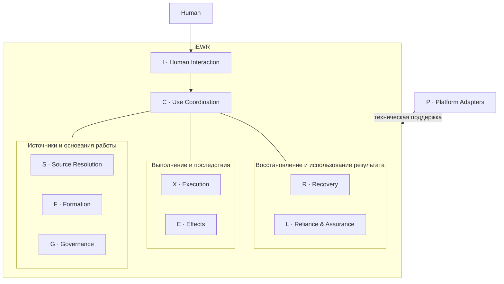

# Instantiatio EWR (iEWR)

**FPF-driven Engineering Work Runtime для организации и исполнения совместной инженерной работы людей, AI-агентов и инструментов.**

Версия: **5.2.1-beta**.
Поставка принята и опубликована в [GitHub Releases](https://github.com/instantiatio/iEWR/releases/tag/v5.2.1-beta).
Проверена на ограниченных локальных сценариях; ограничения проверки описаны в BASELINE_STATUS.md.

## Что такое iEWR

iEWR — инженерная платформа, которая связывает текущую задачу, применимые знания, способ работы, основания действий и их реальные последствия. Она помогает формировать и выполнять ограниченную инженерную работу, менять ход действий по ситуации и восстанавливать основания продолжения после прерывания.

Результатом могут быть требования, архитектура, код, инженерная модель, исследование, документация, рекомендация или обоснованное изменение системы. Разработка программного обеспечения — одна из областей применения.

iEWR использует FPF как внешний semantic foundation, а DPF — как переиспользуемые предметные источники. Люди и AI-агенты выполняют рассуждение и работу с помощью доступных инструментов; назначения, разрешения, ответственность и полномочия устанавливаются из своих прямых оснований. Runtime сохраняет эти различия и делает их доступными для проверки.

## Зачем он нужен

Быстро получить текст или выполнить команду недостаточно, чтобы понять, можно ли использовать результат дальше. Нужно знать, на какие источники опирались, что было разрешено, что действительно изменилось и какие подтверждения нужны конкретному потребителю результата.

iEWR удерживает эту связь при работе нескольких участников, смене агента или среды, изменении исходных данных и частичном выполнении. Размер процесса определяется текущей потребностью: короткий вопрос может завершиться уже достаточным ответом или одним ограниченным действием.

> Текущий вопрос → минимальный полезный результат → остановка; продолжение или пересмотр — только при наличии основания.

## Быстрый старт

1. **Откройте каталог iEWR** в агентной среде, поддерживающей project instructions и работу с файлами. Если получен пакет, сначала распакуйте его.
2. **Поставьте инженерную задачу обычным языком.**
3. **При необходимости укажите исходные материалы и ограничения.**

В текущей поставке project instructions находятся в [AGENTS.md](AGENTS.md). Для начала работы не нужно знать FPF, названия модулей или выбирать режим процесса. iEWR определяет, новая это задача или продолжение, и выясняет, какие дополнительные сведения действительно нужны. Если для существенного действия или решения не хватает основания, он уточняет конкретный недостающий вопрос.

Например:

```text
Помоги сравнить два варианта архитектуры подсистемы.
Требования — в приложенном документе.
```

Избранные bundled DPF уже доступны: агент выбирает полезные для вопроса вклады. Читать весь набор или заранее выбирать каждый паттерн не требуется.

**Дополнительный DPF** можно предоставить отдельно: укажите файл или редакцию и попросите использовать его в задаче. Для постоянного обнаружения источника доступна регистрация; для прямого использования она необязательна. Подробности — [правила подключения](modules/sources/REGISTRATION.md).

**LPF необязателен.** Можно работать без него. Если у проекта есть оформленная локальная практика — LPF, укажите её источник и область применения вместе с задачей.

На выходе вы получаете результат, существенные основания и ограничения, сведения о выполненных проверках и реальных изменениях. Если для нужного использования не хватает данных, технической возможности или решения человека, iEWR обозначает конкретный пробел.

Текущий интерфейс — взаимодействие с агентом в выбранной среде. Подача результата и технические возможности зависят от её конфигурации; отдельный графический интерфейс и готовый автономный сервис в поставке не заявлены.

[Правила взаимодействия](modules/interaction/HUMAN_INTERACTION.md) помогают
агенту представить среду при знакомстве, поддерживать понятную картину работы
и выбирать достаточный текст, таблицу или схему по инженерному вопросу.
Существенные решения, выполненные проверки и оставшиеся вопросы показываются
по ходу; разрешённая рутина не требует повторных подтверждений. Это instruction
support: видимость плана не запускает действия и не подтверждает их результат.
При длительном ожидании агент поясняет выполняемую проверку и её пределы,
если текущая картина стала неясной. Существенные основания и неизвестность
должны быть заметны до зависимого решения; возможность применить уточнение
во время операции зависит от host. Улучшение формы отделяется от добавления
необходимого содержания. Фиксированной частоты сообщений и новых согласований нет.

## Подключение внешнего DPF

Скачайте DPF в [source/external-dpf/](source/external-dpf/), желательно сохранив
исходное имя файла. Затем попросите iEWR обычным текстом:

```text
Зарегистрируй DPF из source/external-dpf/MUSIC-AND-DANCE-PRACTICE-ENGINEERING-PRINCIPLES-FRAMEWORK.md
```

iEWR прочитает exact source, определит identity и edition, зафиксирует digest
и необходимые metadata, затем зарегистрирует источник в project repertoire.
Исходный файл остаётся на месте. Если существенных сведений не хватает, iEWR
назовёт конкретный пробел.

Регистрация делает DPF доступным для discovery. Она не делает его автоматически
applicable, приоритетным или authoritative: iEWR использует только contributions,
подходящие текущему вопросу. DPF — источник предметных знаний и Methods, а не
runtime plugin. Для прямого использования указанного источника регистрация
необязательна.

Новую edition регистрируют явно; она не заменяет активную source basis молча.
Технические правила и границы исполнения — в
[инструкции регистрации](modules/sources/REGISTRATION.md).

## Материалы проекта и развитие iEWR

Положите исходные материалы в `project/source/`, handoff и материалы сравнения —
в `project/reference/`. Результаты находятся в `project/artifacts/`. Подробности
и условно создаваемые каталоги — [project/README](project/README.md). Пустая
структура не запускает работу.

Для доработки самого iEWR достаточно поручения, например:

```text
Доработай iEWR: улучши сообщение об ошибке выбранного адаптера.
Исходная поставка — project/source/iEWR-previous.zip.
Подготовь проверенную новую поставку для моего принятия.
```

По такому explicit scope агент использует [поддержку саморазвития](modules/self_development/GUIDANCE.md):
устанавливает исходные identities, обосновывает изменение, проверяет его и
предъявляет exact candidate ZIP с evidence и полезным опытом. Обычные
пользовательские задачи и регистрация DPF этого подхода не включают.

## Как работает iEWR

**Начинает с текущей потребности.** Сначала определяется, какой результат достаточен для конкретного дальнейшего использования. Если такой результат уже есть и его основания сохраняются, он переиспользуется. Иначе выполняется ограниченная непосредственная работа или получается недостающий подготовительный результат.

**Подключает только нужное знание и подготовку.** Из источников выбираются применимые различения, ограничения и требования к результату. Способ работы (Method) выбирается или уточняется в необходимом объёме; отдельная работа над ним — Method Engineering — нужна, когда вопрос касается самого способа работы. План намеченной работы (WorkPlan) появляется, когда нужна координация, например зависимостей или передачи исполнителю. Сложность задачи сама по себе его не требует.

**Связывает действие с текущими основаниями.** До существенного изменения проверяются исполнитель, возможности, назначение, разрешения, полномочия и технические границы. Факт выполнения учитывается отдельно от результата и эффектов, включая частичные и неизвестные последствия. Успех инструмента не доказывает правильность результата.

**Проверяет соразмерно использованию.** Проверка (Verification) и решение человека запрашиваются, когда они требуются выбранным способом работы, применимым источником, действующими правилами или конкретным дальнейшим использованием. Проверка, подтверждающие сведения (evidence), решение и фактическое использование результата остаются разными фактами.

**Восстанавливается и останавливается обоснованно.** После прерывания восстанавливаются три раздельных набора сведений: действующие основания назначений, разрешений и полномочий; использованная основа выполнения; факты исполнения и эффектов. Неизвестный эффект не повторяется по догадке. Достаточный результат и учтённые последствия позволяют остановиться; изменение основания возвращает только к затронутой части.

Эти обязанности применяются по ситуации. Завершение действия само по себе не создаёт следующую задачу или обязательную проверку.

## Архитектура

iEWR устроен как модульный монолит: девять функциональных модулей и семейство Platform Adapters в согласованном пакете. Инструкции поддерживают предметное рассуждение, детерминированные механизмы — ограниченные проверяемые операции, адаптеры — связь с конкретной средой.

| Модуль | Ответственность |
|---|---|
| **S — Source Resolution** | Разрешает точные источники и применимые вклады, сохраняет редакции и существенные ограничения. Наличие источника не устанавливает его применимость или приоритет. |
| **F — Formation** | Определяет первый нужный результат и достаточную основу работы. Выбирает Method и формирует WorkPlan, когда они нужны текущему вопросу. |
| **G — Governance** | Работает с прямыми основаниями назначений, разрешений, полномочий и решений, их условиями и сроками. Не создаёт authority. |
| **X — Execution** | Проверяет основания действия в момент исполнения, инициирует разрешённые действия и управляет продолжением по ситуации. Сохраняет факты выполнения отдельно от планов. |
| **E — Effects** | Реализует и учитывает уже инициированные действия, технические границы и фактические эффекты. Не инициирует Work/action, retry или repair. |
| **L — Reliance & Assurance** | Оценивает основания использования точного результата конкретным потребителем. Различает evidence, необходимые проверки, решения и наблюдаемое использование. |
| **R — Recovery** | Восстанавливает governance, опорную основу и фактическое выполнение из сохранённых сведений. Возвращает основание продолжения или пробел; самостоятельно repair не выполняет. |
| **C — Use Coordination** | Передаёт явно заданные запросы владельцам и возвращает результаты. Не является workflow engine, очередью или источником автоматических продолжений. |
| **I — Human Interaction** | Обеспечивает понятную подачу, вопросы, ответы и предпочтения пользователя. Обращается через C; представление не создаёт truth или разрешение. |
| **P — Platform Adapters** | Реализует порты доступа к host, хранилищам, инструментам и представлениям. Не владеет semantic decisions. |

**Conceptual view, not a workflow and not the complete dependency graph.**

Карта группирует ответственности; модули не являются обязательными стадиями. Platform Adapters поддерживают технические операции. Точный разрешённый граф зависимостей задан в [C guidance](modules/coordination/GUIDANCE.md).



Исходные записи остаются у своих владельцев; общего изменяемого RuntimeState или authority registry нет. Recovery accounts, dashboards и другие views — производные представления. DPF/LPF остаются источниками и не превращаются в hard-coded runtime routes.

Подробные архитектурные обязательства определяет [Core Architecture Contract](docs/EWR_CORE_ARCHITECTURE_CONTRACT.md).

## FPF, DPF и локальная практика

**FPF Core не входит в поставку iEWR.** [First Principles Framework](https://github.com/ailev/FPF) — внешний semantic foundation и authoritative semantic source. iEWR не является дистрибутивом FPF. Для обычной работы не требуется скачивать, копировать в проект или полностью читать FPF-Spec; правила ограниченного обращения к источникам заданы в [S guidance](modules/sources/GUIDANCE.md).

**Полный [Engineering DPF Suite](https://github.com/ailev/FPF/tree/main/Engineering%20DPF%20Suite) также не входит в поставку.** В текущем репертуаре присутствуют следующие избранные Engineering DPF, образующие базовый engineering corpus:

| Bundled DPF | Предмет |
|---|---|
| [Systems Engineering — SYSE](frameworks/dpf/systems-engineering/) | Системы, архитектура, интерфейсы, реализация и инженерное обеспечение. |
| [Method Engineering — ME](frameworks/dpf/method-engineering/) | Выбор, описание, проверка и изменение способов работы. |
| [Organization Change Engineering — OCE](frameworks/dpf/organization-change-engineering/) | Организационные изменения, рабочие отношения и способности. |
| [Problem Structuring and Decision Support — PSD](frameworks/dpf/problem-structuring-decision-support/) | Постановка проблем, сравнение альтернатив и поддержка решений. |
| [Operations Management — OPS](frameworks/dpf/operations-management/) | Продолжение текущей работы, operating state, commitments, capacity и operating improvement. |

Отдельно в репертуаре присутствует [SDLC DPF](frameworks/dpf/sdlc/) — экспериментальный проектный черновик для ограниченной локальной пробы, **не upstream-публикация Engineering DPF Suite**. Точные редакции и provenance — в [репертуаре](frameworks/dpf/REPERTOIRE.yaml), состав выбранной конфигурации — в [manifest](PACKAGE_MANIFEST.md).

Дополнительные DPF подключаются отдельно **без изменения Core/runtime architecture**. Для каждой задачи используются только применимые DPF и pattern contributions. Наличие в поставке, регистрация, имя каталога или более новая дата не устанавливают applicability, authority или precedence; существенные конфликты разрешаются по прямым основаниям соответствующего утверждения.

Пять upstream DPF сохраняют авторскую дату **2026-09-05**, но закреплены
отдельной licensing revision **2026-09-05-rev-d514a6fc** из commit
`d514a6fcb7908af8e773ed054b9582394f755caf`. Новая строка лицензии — единственная
текстовая delta; дата snapshot не выдаётся за новую авторскую дату. Их обычный путь:
**S → applicable source contribution → F**. Например, OPS.6 может помочь
сформировать ограниченное продолжение по текущему прямому разрешению и Method.
Он не создаёт OPS route, workflow в C или обязательный Admission lifecycle;
выбор действия и изменение записи сами по себе не доказывают Work/progression.

LPF — optional local practice: устойчивые местные способы работы, соглашения и ограничения. iEWR работает без LPF; при наличии используется его применимая часть. Источники проекта и предметной области добавляют фактическую ситуацию, требования и ограничения.

```text
FPF Core — внешний semantic foundation, вне поставки
        ↓ задаёт семантические различения
Selected bundled DPF + optional additional DPF + optional LPF
+ project/domain sources
        ↓ применимые вклады для текущего вопроса
iEWR — формирование, исполнение, контроль эффектов и восстановление
        ↓
Human + AI agents + tools выполняют текущую инженерную работу
        ↓
Инженерный результат / решение / эффект / evidence — по применимости
```

Схема показывает роли источников и runtime. Конкретное полномочие, решение или факт устанавливается из собственного основания, а не из положения на схеме.

## Инженерные принципы

- **Current-first и Direct Work.** Переиспользовать достаточный результат; выполнять ограниченную работу непосредственно, если отдельная подготовка не добавляет ценности.
- **Условная подготовка.** Method Engineering нужен для вопроса о Method, WorkPlan — для координации intended Work. Нет обязательных документов и церемоний без ценности для решения, риска или восстановления.
- **Раздельные основания.** Capability, assignment, permission и authority различаются; execution, Result и actual effects также не подменяют друг друга.
- **Evidence для конкретного использования.** Пригодность результата оценивается относительно receiving use; убедительный AI output или успешный tool call не создаёт Verification и доверие автоматически.
- **Без молчаливой смены основы.** Новая редакция источника, Method, плана или конфигурации не переопределяет уже выполняемое действие. Изменение применяется явно на безопасной границе; пересматриваются только затронутые зависимости — affected-only reopen.
- **Восстановление по фактам.** Re-entry следует детерминированной процедуре там, где доступны достаточные сведения, и явно сообщает неизвестное. Потеря переписки не разрешает повтор эффекта.
- **Честный технический контроль.** `declared`, `enforced`, `compensated`, `unsupported` различают заявленное правило, наблюдаемый контроль, компенсирующую меру и отсутствие поддержки. Название host или согласие человека не доказывает техническую capability.

## Чем iEWR не является

- Новым FPF, новым DPF или полной поставкой FPF / Engineering DPF Suite.
- Универсальным prescribed workflow, project-management methodology или обязательным heavyweight process.
- Authority service или автономным permission source для действий агента.
- Заменой AI harness, Codex, IDE или CI: они предоставляют исполнительские возможности и технические средства.
- Системой, которая автоматически превращает AI output в достоверный, проверенный или допустимый Result.

## Происхождение: iDPF → iEWR

iEWR вырос из [Instantiatio DPF (iDPF)](https://github.com/instantiatio/iDPF). При архитектурной переработке runtime был отделён от исторической process ontology iDPF и перестроен вокруг прямых FPF distinctions и модульной EWR-архитектуры. iDPF теперь является историческим predecessor и provenance source, а не архитектурной основой текущего runtime.

## Статус, releases и дальнейшее чтение

Состав текущей поставки и границы распространения источников указаны в [PACKAGE_MANIFEST.md](PACKAGE_MANIFEST.md). История выпусков ведётся через GitHub Releases текущего репозитория.

Подробности архитектуры и интеграции:

- [Core Architecture Contract](docs/EWR_CORE_ARCHITECTURE_CONTRACT.md) — архитектурные обязательства.
- [Platform Adapters](adapters/ADAPTERS.md) — технические границы работы с агентной средой и инструментами.
- [Source registration](modules/sources/REGISTRATION.md) — подключение дополнительных DPF.
- [Bundled DPF Baseline Refresh and Integration Guide](docs/BUNDLED_DPF_BASELINE_REFRESH_AND_INTEGRATION_GUIDE.md) — сопровождение bundled baseline для maintainers.

## Проверка пакета и DPF baseline

Из корня распакованного продукта:

```text
python -B tools/package/verify_configuration.py --root .
python -B tools/package/prepare.py check --root .
```

Подготовка exact ZIP и сравнение с baseline описаны в
[self-development guidance](modules/self_development/GUIDANCE.md).
Portable maintainer helper проверяет selected bytes и создаёт новый ZIP;
он не меняет hashes, не регистрирует sources и не принимает поставку.
POSIX runtime adapters сохраняют собственные controls и host limits.
Текущие наблюдения, failures/skips и пределы — в [BASELINE_STATUS](BASELINE_STATUS.md).
Development tests/evidence находятся отдельно от product inventory.

## Лицензирование и upstream sources

Собственные материалы iEWR имеют отдельную [LICENSE](LICENSE).
Пять оригинальных DPF Anatoly Levenchuk лицензированы по CC BY 4.0;
exact licenses, attribution, revisions/hashes, отсутствие локальных изменений
и third-party/software boundaries сохранены в [upstream NOTICE](frameworks/dpf/NOTICE.md).
FPF Core не входит в поставку. Local SDLC сохраняет свой experimental local-trial
status; upstream лицензия его автоматически не перелицензирует.
